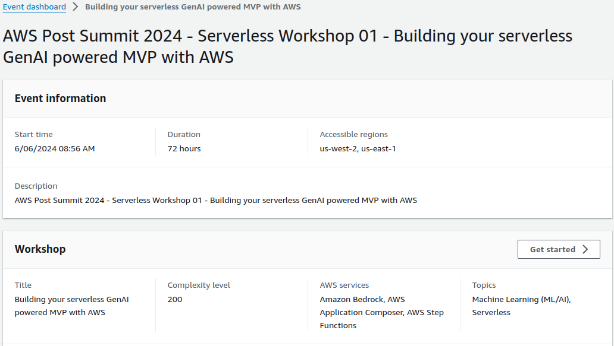
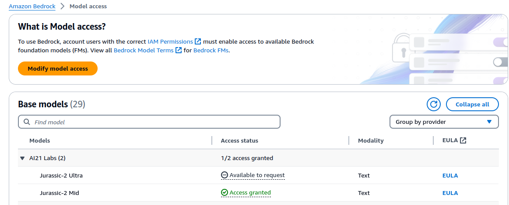
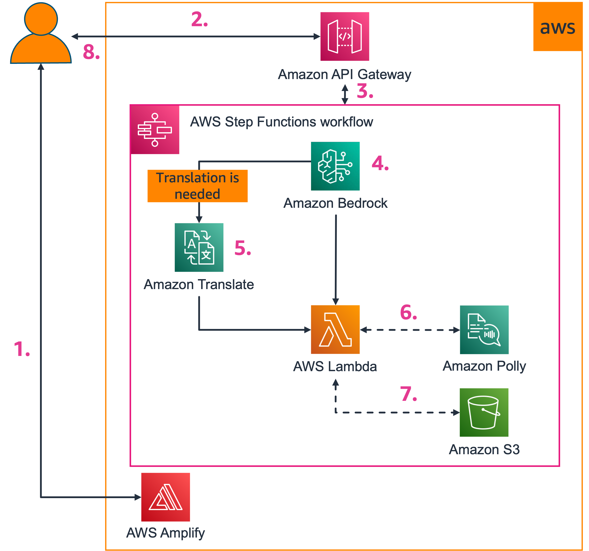
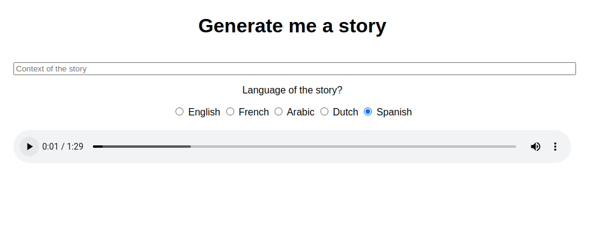

# aws-workshop-serverless-ia
AWS workshop serverless IA: Build your serverless GenAI powered MVP with AWS




# Pre-requisites

- AWS Account
- Configure AWS cli [Link](https://gist.github.com/olcortesb/a471797eb1d45c54ad51d920b78aa664)
- Install AWS Sam [Link](https://docs.aws.amazon.com/serverless-application-model/latest/developerguide/install-sam-cli.html)

- Request access to the model `jurasic-2Mid`



# Architecture



1. The user will connect with the frontend that is deployed on AWS Amplify Hosting
2. After providing story context with selected language, the frontend will submit an HTTP request to our Amazon API Gateway backend
3. The request is proxied and will trigger a syncrounous execution of an AWS Step Functions workflow
4. The first step in the workflow is to generate a unique story by invoking a Large Language Model (LLM) through Amazon Bedrock
5. If the requested language for the story is not english, Amazon Translate will be used to translate the story
6. An AWS Lambda function is invoked and will convert the generated (and eventually translated story) to speech
7. The generated mp3 will be uploaded on Amazon S3
8. A presigned URL  will be returned to the frontend in order for the end-user to play the generated mp3


# Backend

- Deploy the backend with `aws sam`.
- The infrastructure definition is in `template.yaml` file

> Add Spanish language 

```js
// Function that returns the adequate voice depending on the language
const getVoiceId = language => {
  if (language == 'fr') return "Lea"
  if (language == 'nl') return "Laura"
  if (language == 'ar') return "Hala"
  if (language == 'it') return "Bianca"
  if (language == 'es') return "Lucia"
  return "Joanna"
}
```

```bash
sam build
sam deploy
```

## Test the backend:

```bash
  curl --location 'YOUR_API_GATEWAY_ENDPOINT' \
  --header 'Content-Type: application/json' \
  --data '{
      "context": "Pinguu launching a icecream startup in the desert",
      "language": "fr"
  }'

```

# Frontend

Deploy Frontend

- Change the api gateway endpoint

- Upload zip folder to  aws Amplify

- Access to url enable by amplify for test the app in different languages

> Add Spanish language support

```js
fetch('https://shzln4d5ra.execute-api.us-west-2.amazonaws.com/Prod/', {
    method: 'POST',
    headers: {
        'Content-Type': 'application/json',
    },
    body: JSON.stringify(payload),
})
```


# References
- Repository build in base to WorkShop post summit: [Link](https://aws-experience.com/emea/iberia/e/e9354/post-aws-summit-madrid-workshops---serverless-track)